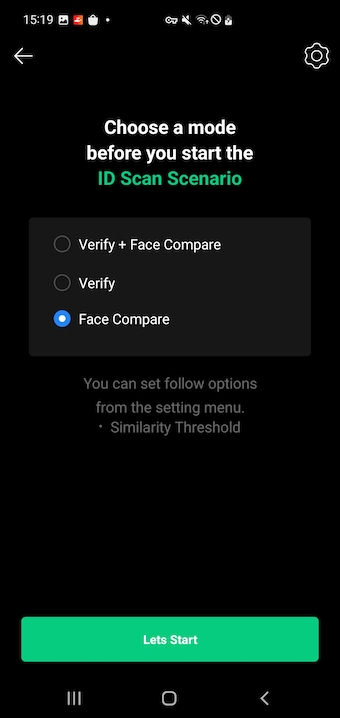

# Table of contents

- [Overview](#Overview)
- [CLOVA eKYC SDK](#CLOVA-eKYC-SDK)
  - [API Manager](#API-Manager)
  - [CLOVA Vision Image](#CLOVA-Vision-Image)
  - [CLOVA Card Detector](#CLOVA-Card-Detector)
  - [CLOVA ID Card Detector](#CLOVA-ID-Card-Detector)
  - [CLOVA Face Detector](#CLOVA-Face-Detector)
- [Demo Scenario (Sample Code)](#Demo-Scenario-Sample-Code)
- [Contact](#Contact)

<br/>

# Overview

CLOVA eKYC is an SDK for developing Electronic Know Your Customer (eKYC) solutions. As a multi-platform SDK, it provides APIs for both Android and iOS platforms. With the card detection feature offered by the SDK and the Vision AI technology-based face recognition and OCR features, a variety of services can be developed to meet the requirements of authentication-related services.

The special features and advantages of the CLOVA eKYC SDK are as follows:

- **Robust security and fast processing speed**

  CLOVA eKYC SDK performs card detection and face recognition on the device without using a server, so it provides results quickly and in real-time without delay. Additionally, it operates even without network connectivity, providing enhanced security.

- **Various card detection**

  CLOVA eKYC SDK can detect cards in real-time, either in compliance with the international standard ratio ([ID-1](https://ko.wikipedia.org/wiki/ISO/IEC_7810)), or at an arbitrary ratio specified by the user, and it recognizes cards at various angles specified by the user. You can verify a variety of ID cards and credit cards, such as national ID cards, driver's licenses, passports, and business registration certificates.

- **Multi-platform supported**

  CLOVA eKYC SDK supports the development of mobile apps on both Android and iOS platforms, allowing you to create mobile apps quickly and easily.

<br/>

# CLOVA eKYC SDK

The CLOVA eKYC SDK consists of four components: Core, Platform, Application, Library.


## Core

- **C++ Native Interface**: provides a C++ API.
- **Card Detector**: a module for card detection.
- **ID Card Detector**: a module for id card detection.
- **Face Detector**: a facial recognition module based on the CLOVA Eyes SDK.
- **Vision Image**: an image processing module used in the CLOVA eKYC SDK.

## Platform

Platform components provide APIs to the following platforms and provide the server request api required for eKYC.

- Android Platform API: provides a Kotlin API that can be called from the Android app.
- iOS Platform API: provides an Swift that can be called from the iOS app.
- API Manager (iOS/Android): support server reqeust api required for eKYC Scenario

## Application

The application component provides sample code for performing tasks such as facial recognition and non-contact identity verification in the form of a project, utilizing the CLOVA eKYC SDK. You can build a project and try running the app.

- Android sample: a sample project implementing an Android app using the CLOVA eKYC SDK.
- iOS sample: a sample project implementing an iOS app using the CLOVA eKYC SDK.

## Library

The external libraries used by the CLOVA eKYC SDK are.

| Library                       | Purpose          | Version     |
| :---------------------------- | :--------------- | :---------- |
| [opencv](https://opencv.org/) | Image conversion | v4.7.0      |
| CLOVA Eyes SDK                | Face detection   | v1.2342.254 |

## Getting Started with development

- [Getting Started on Android](./docs/frameworks/start_AOS.md)
- [Getting Started on iOS](./docs/frameworks/start_iOS.md)

<br/>

## Checking Invoke url & Secret key for using SDK

- [Android](./docs/frameworks/license_AOS.md)
- [iOS](./docs/frameworks/license_iOS.md)

<br/>

## API Manager

API Manager supports server reqeust required for eKYC Scenario. In order to use API Manager, you must create the appropriate domain according to the purpose of use. <br>It provides the following features:

|                         | Android |   iOS   |
| ----------------------- | :-----: | :-----: |
| eKYC Document API | &check; | &check; |
| eKYC Verify API   | &check; | &check; |
| eKYC Compare API  | &check; | &check; |

### Creating API Manager

- [Android](./docs/frameworks/ApiManager/ncp/init_AOS.md)
- [iOS](./docs/frameworks/ApiManager/ncp/init_iOS.md)

### eKYC Document API

- [Android](./docs/frameworks/ApiManager/ncp/document_AOS.md)
- [iOS](./docs/frameworks/ApiManager/ncp/document_iOS.md)

### eKYC Verify API

- [Android](./docs/frameworks/ApiManager/ncp/verify_AOS.md)
- [iOS](./docs/frameworks/ApiManager/ncp/verify_iOS.md)

### eKYC Compare API

- [Android](./docs/frameworks/ApiManager/ncp/compare_AOS.md)
- [iOS](./docs/frameworks/ApiManager/ncp/compare_iOS.md)

<br/>

## CLOVA Vision Image

This is an image format used by CLOVA eKYC SDK. It provides the following features:

| | Android| iOS|
|----------|:----------:|:----------:|
| Image Crop| &check;| &check;|
| Support for various image formats such as BGRA, YUV, etc.| &check; | &check;|

### Create vision image

- [Android](./docs/frameworks/ClovaVisionImage/init_AOS.md)
- [iOS](./docs/frameworks/ClovaVisionImage/init_iOS.md)

### Crop vision image

- [Android](./docs/frameworks/ClovaVisionImage/crop_AOS.md)
- [iOS](./docs/frameworks/ClovaVisionImage/crop_iOS.md)

<br/>

## CLOVA Card Detector

CLOVA card detector is a module that detects Card in real-time on mobile devices, based on [OpenCV](https://opencv.org/). <br>It provides the following features:

| | Android| iOS|
|----------|:----------:|:----------:|
| Card Detection | &check;| &check;|
| Whether to detect each side (top, bottom, left, right)| &check; | &check; |
| Detection of camera shake| &check; | &check;|

### Detecting cards

- [Android](./docs/frameworks/ClovaCardDetector/detect_AOS.md)
- [iOS](./docs/frameworks/ClovaCardDetector/detect_iOS.md)

### Using the best card detection results

- [Android](./docs/frameworks/ClovaCardDetector/shot_card_AOS.md)
- [iOS](./docs/frameworks/ClovaCardDetector/shot_card_iOS.md)

### Using various card detection options for better detection

- [Android](./docs/frameworks/ClovaCardDetector/option_AOS.md)
- [iOS](./docs/frameworks/ClovaCardDetector/option_iOS.md)

<br/>

## CLOVA ID Card Detector

CLOVA ID card detector is a module that detects ID Card with user-specified ratios and face location in real-time on mobile devices, based on [OpenCV](https://opencv.org/). It provides the following features:

|                                                | Android |   iOS   |
| ---------------------------------------------- | :-----: | :-----: |
| ID Card Detection (with face location)         | &check; | &check; |
| Detection of camera shake                      | &check; | &check; |
| Detection of blurry ID card images             |    ✓    |    ✓    |
| Detection of dark ID card images               |    ✓    |    ✓    |
| Detection of reflections within ID card images |    ✓    |    ✓    |

### Detecting id cards

- [Android](./docs/frameworks/ClovaIdCardDetector/detect_AOS.md)
- [iOS](./docs/frameworks/ClovaIdCardDetector/detect_iOS.md)

### Using the best id card detection results

- [Android](./docs/frameworks/ClovaIdCardDetector/shot_card_AOS.md)
- [iOS](./docs/frameworks/ClovaIdCardDetector/shot_card_iOS.md)

### Using various id card detection options for better card detection

- [Android](./docs/frameworks/ClovaIdCardDetector/option_AOS.md)
- [iOS](./docs/frameworks/ClovaCCR/recognize_iOS.md)

<br/>

## CLOVA Face Detector

CLOVA face detector is a face recognition SDK based on the machine learning solution, CLOVA Eyes SDK, which enables the use of vision models on an edge basis. The CLOVA Eyes SDK provides a range of features including face detection, face recognition, and face similarity comparison required for eKYC services, and offers the following features:


| | Android| iOS|
|----------|:----------:|:----------:|
| Face detection| &check;| &check;|
| Face comparison| &check; | &check;|
| 106 and 240 face feature point detection| &check;| &check;|
| Forgery classification| &check;| &check;|
| Mask classification| &check;| &check;|
| Face pose detection| &check;| &check;|
| Live motion check (eg. eye blink, head pose, etc) | &check;| &check;|

### Detecting face

- [Android](./docs/frameworks/ClovaFaceDetector/detect_AOS.md)
- [iOS](./docs/frameworks/ClovaFaceDetector/detect_iOS.md)

### Comparing faces

- [Android](./docs/frameworks/ClovaFaceDetector/compare_AOS.md)
- [iOS](./docs/frameworks/ClovaFaceDetector/compare_iOS.md)

### Processing various information about the face

- [Android](./docs/frameworks/ClovaFaceDetector/info_AOS.md)
- [iOS](./docs/frameworks/ClovaFaceDetector/info_iOS.md)

<br/>

# Demo Scenario (Sample Code)

By building the sample project provided with the CLOVA eKYC SDK, you can run the app to directly see various features required for the eKYC service.

## Sample app menu

By running the sample app, you can try out the representative features provided by the CLOVA eKYC SDK.

 

- **eKYC Scenario**: you can use eKYC scenarios using CLOVA eKYC SDK.
  - **Verify + Face Compare**: you can use ID verification & face compare scenario.
  - **Verify + Face Compare**: you can use ID verification scenario.
  - **Face Compare**: you can use face compare scenario

<br/>

# License

```
CLOVA EyeD(eKYC)
Copyright (c) 2023-present NAVER Cloud Corp.

Unauthorized use, modification and redistribution of this software are strongly prohibited.
```

<br/>

# Contact

## Official internal/external Q\&A channel

- 
