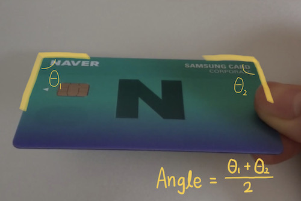

# Using various card detection options for better card detection

## Configuring the detection options

The CLOVA card detector SDK offers various options to detect clearer card images from the input images.  
You can use various options such as light reflection detection and camera shake detection as follows:

```swift
let option = ClovaIdCardDetectorOption()
option.cardRatio = 1.5858
option.targetAngle = 90
option.angleOffset = 5
option.checkSideDetected = false
option.checkCameraShaky = true
option.accumulatedFrameCount = 10
idCardDetector.setOption(option)
```

| Items| Type| Description|
|:----------|:----------|----------|
| `cardRatio`| Float| Percentage of cards to detect|
| `targetAngle`| Int| The angle of the card to be detected is calculated as follows:<br/>|
| `angleOffset`| Int| Angle offset<br/>[targetAngle - angleOffset <= detection angle <= targetAngle + angleOffset]|
| `minimumSize`| Float| Minimum area of the card to be detected (detection card area / card ROI zone `cropRect`)|
| `checkSideDetected`| Bool| Whether to detect and return the card sides (top, bottom, left, right)|
| `checkCameraShaky`      | Bool | Whether to detect camera shake                               |
| `accumulatedFrameCount` | Int     | Number of frames to accumulate when using `shotCard()`       |

