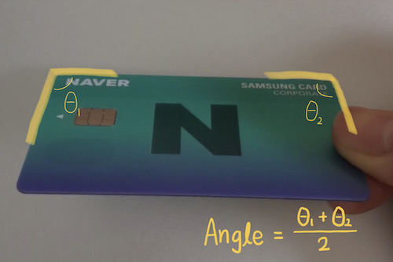

# Using various card detection options for better card detection

## Configuring the detection options

The CLOVA card detector SDK offers various options to detect clearer card images from the input images.  
You can use various options such as light reflection detection and camera shake detection as follows:

```kotlin
val option = ClovaCardDetectorOption(
  cardRatio = 1.5858f,
  targetAngle = 90,
  angleOffset = 5,
  minimumSize = 0.65f,
  checkSideDetected = false,
  checkCameraShaky = false,
  checkImageBlurry = false,
  checkImageDark = false,
  checkGlareDetected = false,
  blurThreshold = 0.13f,
  darkThreshold = 7,
  glarePercentage = 0.05f,
  faceLocation = IdFaceLocation.ANY_WHERE,
  accumulatedFrameCount = 10
)
```

| Items| Type| Description|
|:----------|:----------|----------|
| `cardRatio`| float| Ratio of id cards to detect |
| `targetAngle`| int| The angle of the card to be detected is calculated as follows:<br/> |
| `angleOffset`| int| Angle offset<br/>[targetAngle - angleOffset <= detection angle <= targetAngle + angleOffset]|
| `minimumSize`| float| Minimum area of the card to be detected (detection card area / card ROI zone `cropRect`)|
| `checkSideDetected`| boolean| Whether to detect and return the card sides (top, bottom, left, right)|
| `checkCameraShaky`         | boolean          | Whether to detect camera shake                               |
| `checkImageBlurry`         | boolean          | Whether to detect blur in the card zone                      |
| `checkImageDark`           | boolean          | Whether to detect darkness                                   |
| `checkGlareDetected`       | float            | Whether to detect light reflection in the card zone          |
| `blurThreshold`            | float            | Threshold about blur detection                               |
| `darkThreshold`            | float            | Threshold about dark detection (step 1..10)                  |
| `glarePercentage`          | float            | Threshold about glare detection (Based on percentage)        |
| `faceLocation`             | `IdFaceLocation` | Set the photo location of the ID card to detect              |
| `IdFaceLocation.ANY_WHERE` | enum             |                                                              |
| `IdFaceLocation.LEFT`      | enum             |                                                              |
| `IdFaceLocation.RIGHT`     | enum             |                                                              |
| `IdFaceLocation.NONE`      | enum             |                                                              |
| `accumulatedFrameCount`    | int              | Number of frames to accumulate when using `shotIdCard()` |
